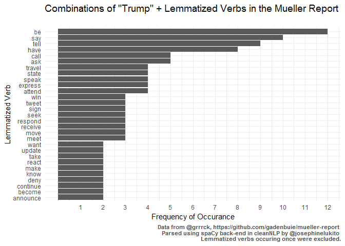

An analysis of the redacted Mueller report using clearNLP
================
jlukito
April 18, 2019

``` r
library(tidyverse)
library(ggplot2)
library(RCurl)
library(tokenizers)
library(dplyr)
library(reticulate)

library(cleanNLP)
```

Our goal today is to use `cleanNLP` to analyze the Mueller Report. `cleanNLP` is a popular text analysis tool for specific advanced natural language processing (NLP) tasks. It is especially useful for doing 3 NLP tasks in R: part-of-speech tagging, dependency parsing, and entity recognition. Combined, researchers can use these three tools to do really interesting computational linguistic analysis, like identifying syntactic constructions, attributing sentiment words to specific entities or nouns, or comparing grammars in different genres.

cleanNLP documentation: <https://cran.r-project.org/web/packages/cleanNLP/cleanNLP.pdf>

Importing the data
==================

``` r
data <- read.csv("mueller_report.csv")
mreport <- paste(as.character(data$text), " ")
```

Initializing
============

The first thing we need to do is initialize the back-ends.

spaCy and coreNLP downloading: <https://github.com/statsmaths/cleanNLP>

``` r
#cnlp_init_corenlp("en", anno_level = 2)

cnlp_init_spacy("en_core_web_sm") 
```

Tokenizing
==========

``` r
starttime <- Sys.time()
spacy_annotate<- mreport %>% as.character() %>% cnlp_annotate(as_strings = TRUE, backend = "spaCy") #produces an annotation object
endtime <- Sys.time()
```

Entity Recognition
==================

For a list of `spaCy` entities, see the `cleanNLP` documentation: <https://cran.r-project.org/web/packages/cleanNLP/cleanNLP.pdf>

``` r
starttime <- Sys.time()
spacy_entity <- cnlp_get_entity(spacy_annotate)
endtime <- Sys.time()
```

``` r
top_entities <- table(spacy_entity$entity) %>% as.data.frame() %>% subset(Freq > 100)
top_entities[order(-top_entities$Freq),]
```

    ##                            Var1 Freq
    ## 1199                        302 1008
    ## 6221                     Russia  678
    ## 3247                      Cohen  665
    ## 7134                      Trump  659
    ## 6227                    Russian  645
    ## 3957                      Flynn  475
    ## 5176                     McGahn  438
    ## 7245 U.S. Department of Justice  400
    ## 3331                     Corney  398
    ## 4944                   Manafort  365
    ## 3846                        FBI  328
    ## 6458                   Sessions  321
    ## 7233                       U.S.  296
    ## 1143                          3  289
    ## 887                           2  284
    ## 5681                     Office  252
    ## 1329                          4  241
    ## 86                            1  228
    ## 5774               Papadopoulos  225
    ## 1504                          5  218
    ## 4770                    Kushner  195
    ## 7308              United States  191
    ## 6033                    R. Crim  184
    ## 3215                    Clinton  175
    ## 4750                    Kislyak  175
    ## 984                        2016  162
    ## 5943                    Priebus  162
    ## 1682                          6  161
    ## 7487                  WikiLeaks  152
    ## 3305                   Congress  151
    ## 1864                          7  149
    ## 5755                     P. 6(e  143
    ## 3599                   Dmitriev  134
    ## 4130                        GRU  132
    ## 4739                   Kilimnik  132
    ## 5358                     Moscow  132
    ## 6027                  R. Criffl  130
    ## 5173                  McFarland  127
    ## 784                          18  118
    ## 2947                     Bannon  117
    ## 3107                   Campaign  117
    ## 7219                        two  112
    ## 5992                      Putin  109
    ## 794                      18 302  107
    ## 5714                        one  105
    ## 4869                Lewandowski  104
    ## 323                          11  103
    ## 2238                          9  103
    ## 5438                      Nader  101

Dependency Parsing
==================

Universal Dependencies: <http://universaldependencies.org/u/dep/index.html>

``` r
spacy_dependency <- cnlp_get_dependency(spacy_annotate, get_token = TRUE)
```

``` r
tsubj <- subset(spacy_dependency, lemma_target == "Trump" & relation == "nsubj")
tobj <- subset(spacy_dependency, lemma_target == "Trump" & relation == "dobj")
```

``` r
knitr::kable(tsubj[1:15,], caption = "spaCy Mueller Report Trump dependencies")
```

| id      |  sid|  tid|  tid\_target| relation | relation\_full | word      | lemma   | word\_target | lemma\_target |
|:--------|----:|----:|------------:|:---------|:---------------|:----------|:--------|:-------------|:--------------|
| doc166  |    2|    3|            2| nsubj    | NA             | signed    | sign    | Trump        | Trump         |
| doc184  |    1|    7|            5| nsubj    | NA             | becoming  | become  | Trump        | Trump         |
| doc256  |    2|    8|            7| nsubj    | NA             | tweeted   | tweet   | Trump        | Trump         |
| doc285  |    1|    6|            5| nsubj    | NA             | fired     | fire    | Trump        | Trump         |
| doc292  |    1|    4|            3| nsubj    | NA             | reacted   | react   | Trump        | Trump         |
| doc1749 |    2|    7|            6| nsubj    | NA             | made      | make    | Trump        | Trump         |
| doc1883 |    1|    9|            8| nsubj    | NA             | said      | say     | Trump        | Trump         |
| doc1912 |    1|    3|            2| nsubj    | NA             | told      | tell    | Trump        | Trump         |
| doc1931 |    2|    8|            7| nsubj    | NA             | expressed | express | Trump        | Trump         |
| doc2149 |    1|    6|            3| nsubj    | NA             | pay       | pay     | Trump        | Trump         |
| doc2179 |    1|    5|            4| nsubj    | NA             | stated    | state   | Trump        | Trump         |
| doc2182 |    1|    8|            7| nsubj    | NA             | made      | make    | Trump        | Trump         |
| doc2371 |    1|    4|            2| nsubj    | NA             | moving    | move    | Trump        | Trump         |
| doc2430 |    1|   16|           15| nsubj    | NA             | attended  | attend  | Trump        | Trump         |
| doc2446 |    3|    7|            6| nsubj    | NA             | met       | meet    | Trump        | Trump         |

``` r
trump_nsubj_verb <- table(tsubj$lemma) %>% as.data.frame() %>% subset(Freq > 1)
```

Visualizing
===========

``` r
ggplot(trump_nsubj_verb, aes(x = reorder(Var1, Freq), y = Freq)) +
  geom_bar(stat = "identity") + coord_flip() + 
  scale_y_continuous(breaks = c(1, 2, 3, 4, 5, 6, 7, 8, 9, 10, 11, 12)) +
  labs(title = "Combinations of \"Trump\" + Lemmatized Verbs in the Mueller Report",
       subtitle = "",
       x = "Lemmatized Verb",
       y = "Frequency of Occurance",
       caption = "Data from @grrrck, https://github.com/gadenbuie/mueller-report \n Parsed using spaCy back-end in cleanNLP by @josephinelukito \n Lemmatized verbs occuring once were excluded.") +
  
  theme_minimal() + theme(text = element_text(family = "Decima WE"),
                          plot.subtitle=element_text(face="italic",size=11,colour="grey40"),
                          plot.caption=element_text(face ="bold",size=8,colour="grey30"),
                          plot.title=element_text(size=14))
```


